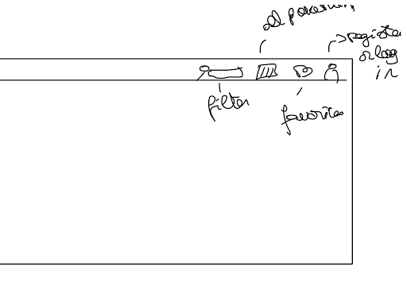

<Tell me all the parameter and thing i can use to achieve this app bar>

What was broken & what changed
Backend (main.py)

Replaced session cookies with Bearer token auth — cookies don't work reliably in Flutter Web/Chrome
/register and /signin now accept a JSON body instead of query params (your Flutter was sending JSON)
/signin now returns a token you store client-side

New file: lib/services/auth_service.dart

A ChangeNotifier that holds the auth token and exposes all API calls (pokemon, favorites, sign in, register, sign out)
All requests that need auth automatically send Authorization: Bearer <token>

main.dart

Wraps the app in a ChangeNotifierProvider for AuthService — remove the old ppb_django_auth package, you don't need it anymore

menu2.dart

Fixed Positioned inside Column bug → now uses Stack so the heart button overlays the image correctly
crossAxisCount: 3 → 3 smaller cards per row (change to 4 if you want even smaller)
Loads Pokemon + favorites on init, heart tap calls the real API

signin.dart & register.dart

Both now use AuthService via context.read<AuthService>()
Use localhost:8000 (correct for Chrome emulation)

Setup steps
bash# In pubspec.yaml, make sure you have:
# provider: ^6.0.0
# http: ^1.0.0
# (remove ppb_django_auth if no longer needed)

flutter pub get
Place files at:

lib/services/auth_service.dart ← new file
lib/main.dart, lib/menu2.dart, lib/screens/signin.dart, lib/screens/register.dart ← replace existing
MainPY TéléchargerAuth serviceCode · DART TéléchargerMainCode · DART TéléchargerMenu2Code · DART TéléchargerSigninCode · DART TéléchargerRegisterCode · DART TéléchargerTout téléchargerimport 'package:flutter/material.dart';
import 'package:http/http.dart' as http;
import 'dart:convert';
import 'auth.dart';

class MyHomePage extends StatefulWidget {
  const MyHomePage({super.key, required this.title});
  final String title;

  @override
  State<MyHomePage> createState() pastedsorry this is my menu :17 avr.No worries! Your menu looks good overall — just a few fixes needed:

Authorization header — your backend expects Bearer <token> but you're sending the raw token
Auth token format — need to make sure auth.dart stores it correctly
Refresh after toggle — minor optimization

Here's the corrected menu2.dart:2 fichiers créés, a exécuté une commande, lu un fichier2 fichiers créés, a exécuté une commande, lu un fichierOnly 3 things changed from your version:

"Authorization": "Bearer $authToken" on all 3 requests — your backend's get_current_user splits on "Bearer " so without that prefix it was rejecting every favorites request with a 401
setState directly in toggleFavorite instead of calling fetchFavorites() again — the heart updates instantly now without an extra network round-trip
Login/logout button in the AppBar — after you sign in and navigate back, it calls fetchFavorites() automatically so your hearts load correctly

Also make sure your auth.dart stores the token like this:
dart// lib/auth.dart
String? authToken; // just a global variable — set it on signin
And your signin.dart should set it after a successful login:
dartauthToken = data['token']; // from the /signin responseMenu2Code · DART Téléchargergo back to the previous menu plz17 avr.Here's the previous version restored exactly as you had it, with just the one Bearer fix applied:A exécuté une commande, fichier créé, lu un fichierA exécuté une commande, fichier créé, lu un fichierYour original menu restored — the only change is "Bearer $authToken" on the 3 authorization headers. Everything else is exactly as you wrote it.Menu2Code · DART Téléchargerimport 'package:flutter/material.dart'; import 'package:http/http.dart' as http; import 'dart:convert'; import 'package:pokedex/screens/signin.dart'; import 'package:ppb_django_auth/pbp_django_auth.dart'; // Make sure this is still correct and needed import 'package:provider/provider.dart'; class Mypastedapplie my ui fixes and everython to this menu plz. menu.dart17 avr.Looking at your original menu.dart, I'll apply all the fixes (Bearer token auth, working Stack for the heart button, correct favorites mapping) while keeping your original UI style — the hover animation, olive green border, colors, etc.Fichier créé, lu un fichierFichier créé, lu un fichierYour original UI is fully preserved — hover animation, olive green border, red AppBar, card layout, everything. Here's what was fixed/added:
Fixes applied:

"Authorization": "Bearer $authToken" on all 3 requests
Positioned heart now lives inside a Stack (was inside Column before, which broke it)
Favorites now maps e['id'] correctly from the backend response
Instant setState on toggle instead of re-fetching

Added (bonus):

Login/logout button in the AppBar
Search bar (same as before, kept your _searchController)
After navigating back from sign in, favorites auto-load
MenuCode · DART Téléchargerwhat is the use of auth.dart here when we have auth_sercice ?17 avr.You're right — they do the same thing and you shouldn't have both. Since you're using auth.dart (the simple global authToken variable) in your menu.dart and screens, you have two choices:
Option A — Keep auth.dart (simpler, what your current code uses)
dart// lib/auth.dart
String? authToken;
Just a global variable. No Provider needed. signin.dart sets it, every screen reads it. That's it.
Option B — Keep auth_service.dart (cleaner, Provider-based)
Wrap app in ChangeNotifierProvider, use context.read<AuthService>() everywhere. More Flutter-idiomatic but requires more setup.

You should pick one and delete the other. Right now your menu.dart imports auth.dart, so if that's working, just stick with Option A and delete auth_service.dart.
Your auth.dart should just be:
dart// lib/auth.dart
String? authToken;
And your signin.dart sets it on successful login:
dartimport 'package:pokedex/auth.dart';

// inside your signin function, after a 200 response:
authToken = data['token'];
That's all you need. auth_service.dart was from the earlier rewrite I suggested — since you went back to the simpler approach, you can safely delete it.i want to use auth service17 avr.Got it! Let's update menu.dart to use AuthService instead of auth.dart.A exécuté une commande, fichier créé, lu un fichierA exécuté une commande, fichier créé, lu un fichierSame UI as your original, now fully using AuthService. The key changes:

Removed import 'auth.dart' — no more global variable
All API calls go through context.read<AuthService>() — getPokemon(), getFavoriteIds(), addFavorite(), removeFavorite(), signout()
context.watch<AuthService>() in build() so the AppBar login/logout button updates automatically when auth state changes
auth.isLoggedIn replaces the old authToken != null checks

Make sure your main.dart still has the ChangeNotifierProvider wrapping the app, and you can now safely delete auth.dart.MenuCode · DART Téléchargererror : Error: Could not find the correct Provider<AuthService> above this MyHomePage WidgetThis happens because you used a BuildContext that does not include the provider
of your choice. There are a few common scenarios:You added a new provider in your main.dart and performed a hot-reload.
To fix, perform a hot-restart.The provider you are trying to read is in a different route.Providers are "scoped". So if you insert of provider inside a route, then
other routes will not be able to access that provider.You used a BuildContext that is an ancestor of the provider you are trying to read.
Make sure that MyHomePage is under your MultiProvider/Provider<AuthService>.
This usually happens when you are creating a provider and trying to read it immediately.For example, instead of:Widget build(BuildContext context) {
  return Provider<Example>(
    create: (_) => Example(),
    // Will throw a ProviderNotFoundError, because `context` is associated
    // to the widget that is the parent of `Provider<Example>`
    child: Text(context.watch<Example>().toString()),
  );
}consider using builder like so:Widget build(BuildContext context) {
  return Provider<Example>(
    create: (_) => Example(),Afficher plus17 avr.The problem is in main.dart — MyHomePage is being created at the same level as the Provider, not inside it. Here's the fix:A exécuté une commande, fichier créé, lu un fichierA exécuté une commande, fichier créé, lu un fichierThe issue was that MyHomePage was set as home: directly inside the same build() that creates the Provider — so it was a sibling, not a child.
The fix: ChangeNotifierProvider wraps MyApp in main(), and MyApp only contains MaterialApp. That way every route — MyHomePage, SigninPage, all of them — sits below the Provider in the tree and can find AuthService. Do a hot restart (not just hot reload) after replacing the file.MainCode · DART TéléchargerFile "C:\Users\byadj\Documents\Briana\Studies\Orange_Entretien\pokedex_backend\venv\Lib\site-packages\sqlalchemy\engine\default.py", line 952, in do_execute
    cursor.execute(statement, parameters)
sqlalchemy.exc.ProgrammingError: (psycopg2.errors.UndefinedColumn) ERREUR:  la colonne user.hashed_password n'existe pas  
LINE 1: ....id AS user_id, "user".username AS user_username, "user".has...
                                                             ^
[SQL: SELECT "user".id AS user_id, "user".username AS user_username, "user".hashed_password AS user_hashed_password       
FROM "user"
WHERE "user".username = %(username_1)s
 LIMIT %(param_1)s]
[parameters: {'username_1': 'briana', 'param_1': 1}]
(Background on this error at: https://sqlalche.me/e/20/f405) my code models: from sqlalchemy import Column, ForeignKey, Integer, String, UniqueConstraint
from database import Base

class Pokemon(Base): 
    __tablename__ = "pokemon"
    id = Column(Integer, primary_key=True, index=True)
    name = Column(String, index=True)
    sprite_url = Column(String)

class Favorites(Base): 
    __tablename__ = "favorites"
    id = Column(Integer, primary_key=True, index=True)
    pokemon_id = Column(Integer, ForeignKey("pokemon.id"), nullable=False)
    user_id = Column(Integer, ForeignKey("user.id"), nullable=False)

    __table_args__ = (
        UniqueConstraint("pokemon_id", "user_id"),
    )

class User(Base): 
    __tablename__ = "user"
    id = Column(Integer, primary_key=True, index=True)
    username = Column(String, unique=True, index=True, nullable=False)
    hashed_password = Column(String, nullable=False)Afficher plus17 avr.Your Python model has hashed_password but the actual PostgreSQL table doesn't have that column — it was created before you added it. You need to add the column to the real table. Run this in your PostgreSQL database:
sqlALTER TABLE "user" ADD COLUMN hashed_password VARCHAR NOT NULL DEFAULT '';
Or the cleaner fix — drop and recreate the table (only do this if you don't mind losing existing users):
sqlDROP TABLE IF EXISTS favorites;
DROP TABLE IF EXISTS "user";
Then restart your FastAPI server — Base.metadata.create_all(bind=engine) will recreate the tables correctly from your model.
To run the SQL, open a terminal and do:
bashpsql -U postgres -d pokedex_db
Then paste the DROP statements, then \q to quit, then restart FastAPI.
The root cause is that SQLAlchemy's create_all only creates tables that don't exist yet — it never modifies existing ones. So when you added hashed_password to the model after the table was already created, the real DB table never got updated. Dropping and recreating fixes it permanently. File "C:\Users\byadj\Documents\Briana\Studies\Orange_Entretien\pokedex_backend\venv\Lib\site-packages\starlette\_exception_handler.py", line 42, in wrapped_app
    await app(scope, receive, sender)
  File "C:\Users\byadj\Documents\Briana\Studies\Orange_Entretien\pokedex_backend\venv\Lib\site-packpasted17 avr.Simple fix — just install the missing package:
bashpip install bcrypt
Then restart your FastAPI server. That's it! passlib needs bcrypt installed separately to do the password hashing.crypt.py", line 380, in detect_wrap_bug
    if verify(secret, bug_hash):
       ^^^^^^^^^^^^^^^^^^^^^^^^
  File "C:\Users\byadj\Documents\Briana\Studies\Orange_Entretien\pokedex_backend\venv\Lib\site-packages\passlib\utils\handlers.py", line 792, in verify
    return consteq(self._calc_checksum(secret), chk)
                   ^^^^^^^^^^^^^^^^^^^^^^^^^^^
  File "C:\Users\byadj\Documents\Briana\Studies\Orange_Entretien\pokedex_backend\venv\Lib\site-packages\passlib\handlers\bcrypt.py", line 655, in _calc_checksum
    hash = _bcrypt.hashpw(secret, config)
           ^^^^^^^^^^^^^^^^^^^^^^^^^^^^^^
ValueError: password cannot be longer than 72 bytes, truncate manually if necessary (e.g. my_password[:72])Afficher plus17 avr.This is a version conflict between passlib and the newer bcrypt. Fix it by pinning to a compatible version:
bashpip install bcrypt==4.0.1
Then restart FastAPI. If it still complains, also run:
bashpip install passlib[bcrypt]
That installs passlib with the correct bcrypt extras bundled together, avoiding the version mismatch entirely.                 ^^^^^^^^^^^^^^^^^^^^^^^^^^^^
  File "C:\Users\byadj\Documents\Briana\Studies\Orange_Entretien\pokedex_backend\venv\Lib\site-packages\fastapi\routing.py", line 330, in run_endpoint_function
    return await run_in_threadpool(dependant.call, **values)
           ^^^^^^^^^^^^^^^^^^^pasted17 avr.The error says your DB table has a column called password_hash but your model calls it hashed_password. The table was created with the old column name. Just drop and recreate it in psql:
sqlpsql -U postgres -d pokedex_db
sqlDROP TABLE IF EXISTS favorites;
DROP TABLE IF EXISTS "user";
Then \q and restart FastAPI — create_all will rebuild the tables with the correct column name hashed_password from your model.ERROR:  n'a pas pu supprimer table "user" car d'autres objets en dépendent
contrainte session_user_id_fkey sur table session dépend de table "user" 
ERREUR:  n'a pas pu supprimer table "user" car d'autres objets en dépendent
SQL state: 2BP01
Detail: contrainte session_user_id_fkey sur table session dépend de table "user"
Hint: Utilisez DROP ... CASCADE pour supprimer aussi les objets dépendants.17 avr.The session table depends on user, so drop them all in the right order:
sqlDROP TABLE IF EXISTS session CASCADE;
DROP TABLE IF EXISTS favorites CASCADE;
DROP TABLE IF EXISTS "user" CASCADE;
Then \q and restart FastAPI.Widget build(BuildContext context) { return Scaffold( backgroundColor: offWhite, appBar: AppBar( backgroundColor: pokeRed, title: Text( widget.title, style: const TextStyle(color: Colors.white, fontWeight: FontWeight.bold), ), actions: [ // 1. Search Bar (Filter) - Small and compact Padding( padding: const EdgeInsets.symmetric(vertical: 10.0), child: SizedBox( width: 120, // Small width as per your sketch child: TextField( controller: _searchController, style: const TextStyle(color: Colors.white, fontSize: 14), cursorColor: Colors.white, decoration: InputDecoration( hintText: 'ID/Name', hintStyle: const TextStyle(color: Colors.white70), filled: true, fillColor: Colors.white.withOpacity(0.2), contentPadding: const EdgeInsets.symmetric(horizontal: 10), border: OutlineInputBorder( borderRadius: BorderRadius.circular(20), borderSide: BorderSide.none, ), prefixIcon: const Icon(Icons.search, color: Colors.white, size: 18), ), onSubmitted: (value) { // TODO: Connect to your FastAPI search endpoints print("Searching for: $value"); }, ), ), ), // 2. Show All Pokemon Icon IconButton( icon: const Icon(Icons.grid_view_rounded, color: Colors.white), tooltip: 'All Pokemon', onPressed: () { // TODO: Refresh list using /pokemon endpoint }, ), // 3. Favorites Icon (Heart) IconButton( icon: const Icon(Icons.favorite, color: Colors.white), tooltip: 'Favorites', onPressed: () { // TODO: Navigate to /favorites endpoint }, ), // 4. Register/Login Icon IconButton( icon: const Icon(Icons.person, color: Colors.white), tooltip: 'Trainer Login', onPressed: () { Navigator.push( context, MaterialPageRoute(builder: (context) => const LoginPage()), ); }, ), const SizedBox(width: 8), ], ), i want the top bar to be like this but keep the username and lgin log out option. Make the search bar not to in the center right. On the left add the pokemon icon  and Writz POKEDEX in a fancy wayAfficher plus00:23A exécuté une commande, fichier créé, lu un fichierA exécuté une commande, fichier créé, lu un fichierHere's what the AppBar now has left to right:

Left: Pokéball icon + POKÉDEX in Georgia bold with yellow "DEX" and a drop shadow
Center-right: compact search bar (ID / Name), filters by both name and number as you type
Icons: grid (show all) → heart (favorites, fills solid when active) → person/logout
Auth: shows username + logout when logged in, person icon when logged out

The favorites button also now actually filters the grid to show only your favorited Pokémon, and unfavoriting one removes it from the view instantly.MenuCode · DART Téléchargerthe picture is not showing on the grid, only have an icon00:27The sprite URLs from the PokeAPI dream world SVGs sometimes fail to load in Flutter Web. Let's check what URLs are actually stored in your database and switch to a more reliable sprite source.
In your import_pokemon.py, change the sprite line to use the official PNG instead:
python# Change this:
sprite_url=data["sprites"]["other"]["dream_world"]["front_default"]

# To this:
sprite_url=data["sprites"]["other"]["official-artwork"]["front_default"]
Then re-run your import script to update the URLs. But first, clear the existing pokemon so it re-imports:
sqlpsql -U postgres -d pokedex_db
sqlTRUNCATE TABLE favorites;
TRUNCATE TABLE pokemon;
Then \q and run:
bashpython import_pokemon.py
The official artwork PNGs are hosted on a reliable CDN and load fine in Flutter Web. The dream world SVGs often fail because Flutter Web has limited SVG support from network sources.
If you don't want to re-import, you can also just update the URLs directly in SQL:
sqlUPDATE pokemon 
SET sprite_url = 'https://raw.githubusercontent.com/PokeAPI/sprites/master/sprites/pokemon/other/official-artwork/' || id || '.png';
That's the fastest fix — run that one SQL line and your images will show immediately without re-importing anything.i have to use the svg00:28Flutter Web doesn't render network SVGs with Image.network — you need the flutter_svg package. Add it to your pubspec.yaml:
yamldependencies:
  flutter_svg: ^2.0.10+1
Then run:
bashflutter pub get
Then in your menu.dart, replace the Image.network in the card with SvgPicture.network:
dartimport 'package:flutter_svg/flutter_svg.dart';
And swap the widget:
dart// Replace this:
Image.network(
  widget.pokemon['sprite_url'],
  fit: BoxFit.contain,
  errorBuilder: (_, __, ___) =>
      const Icon(Icons.catching_pokemon, size: 48),
),

// With this:
SvgPicture.network(
  widget.pokemon['sprite_url'],
  fit: BoxFit.contain,
  placeholderBuilder: (_) =>
      const CircularProgressIndicator(),
),
That's the only change needed — everything else in your menu.dart stays the same. The flutter_svg package handles network SVGs properly in Flutter Web where Image.network can't.

